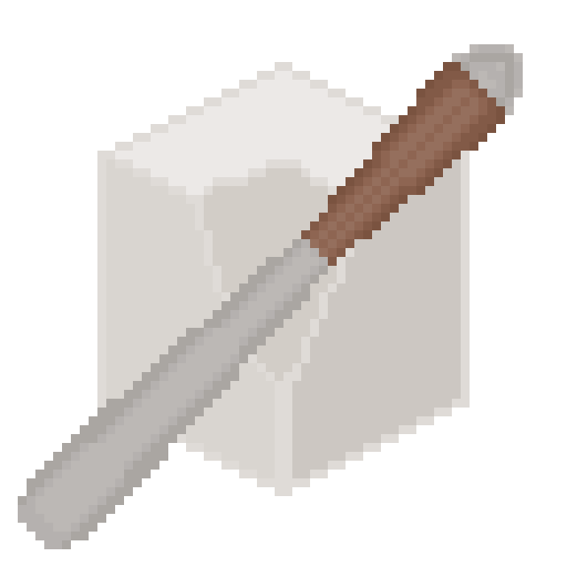

# CHIVEL

CHIVEL, previously known as CHISL (Computer-Human Interaction Scripting Language) is a Python extension meant for controlling your device. It provides simple interfaces for finding things on the screen, controlling the keyboard/mouse, manipulating images, and more. This was originally its own scripting language, but was later revamped into a Python module, so that the powerful features of Python could be used in addition to the computer vision that CHIVEL provides. The project was also renamed from CHISL to CHIVEL, as CHISL was already taken on PyPI.

## How To Use

Install the Python [module](https://pypi.org/project/chivel/):

    pip install chivel

Import chivel and have at it!

## Example

    import chivel
    x = chivel.load("x.png")
    screen = chivel.capture()
    matches = chivel.find(screen, x)
    for match in matches:
        chivel.mouse_move(match)
        chivel.mouse_click()

## Features

Here is a list of functions that CHIVEL has to offer.

| Function | Description |
| --- | --- |
| load(path) | Load an image from a file |
| save(image, path) | Save an image to a file |
| capture(display_index=0, rect?) | Capture all or part of a screen |
| find(image, image/text, threshold=0.8, text_level=TEXT_PARAGRAPH) | Finds an image template or some text within the given image |
| wait(seconds) | Wait for a specified number of seconds |
| mouse_move(display_index, position/rect) | Moves to the position (or center of the rect) on the given display |
| mouse_click(button=0, count=1) | Click the mouse button |
| mouse_down(button=0) | Press a mouse button down |
| mouse_up(button=0) | Release a mouse button |
| mouse_scroll(vertical, horizontal=0) | Scroll the mouse wheel vertically and/or horizontally |
| mouse_get_location() | Get the current mouse monitor index and cursor location |
| mouse_get_display() | Get the current mouse display index |
| type(text, wait=0.05) | Type a string using the keyboard |
| key_click(key, count=1) | Click a key on the keyboard |
| key_down(key) | Press a key down |
| key_up(key) | Release a key |
| record(path, simplify=SIMPLIFY_ALL, stop_key=KEY_F12) | Record a sequence of actions to a Python script |
| play(path, func_name="play") | Play a recorded sequence of actions from a Python script |
| display_get_rect(display_index) | Get the rectangle of a specific display, relative to the primary display |