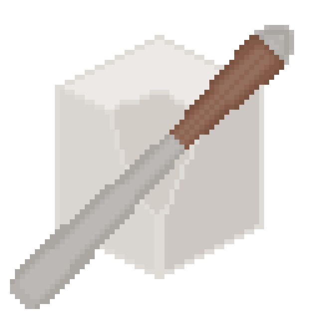

# CHIVEL



CHIVEL, previously known as CHISL (Computer-Human Interaction Scripting Language) is a Python extension meant for controlling your device. It provides simple interfaces for finding things on the screen, controlling the keyboard/mouse, manipulating images, and more. This was originally its own scripting language, but was later revamped into a Python module, so that the powerful features of Python could be used in addition to the computer vision that CHIVEL provides. The project was also renamed from CHISL to CHIVEL, as CHISL was already taken on PyPI.

CHIVEL is a Python automation toolkit for:

- Screen capture on multi-display setups
- OCR text lookup
- Template matching
- Mouse and keyboard automation
- Record and replay workflows
- Lightweight image processing and drawing

It is designed for practical desktop automation and test scripting.

## Install

```bash
pip install chivel
```

## Quick Start

```python
import chivel as cv

# Capture the primary display and find text.
img = cv.capture()
hits = cv.find_text(img, "Settings")

if hits:
	img.draw_matches(hits, color=cv.Color(255, 0, 0), thickness=2)
	cv.save(img, "hits.png")
```

## Core Data Types

- Point(x, y)
- Rect(x, y, width, height)
- Color(r, g, b, a=255)
- Match(rect, label=None)
- Image(width, height, channels=3)
- Recording(version, recorded_at, stop_key, events)

## Display and Capture APIs

### DISPLAY_COUNT

Number of detected displays.

```python
print(cv.DISPLAY_COUNT)
```

### set_primary_display(display_index)

Sets the default display used by APIs that allow omitted display index.

```python
cv.set_primary_display(1)
```

### get_primary_display()

Returns the current default display index.

```python
idx = cv.get_primary_display()
print(idx)
```

### display_get_rect(display_index=None)

Returns global screen-space bounds for a display.

```python
rect = cv.display_get_rect()      # uses primary display
rect0 = cv.display_get_rect(0)    # explicit display
```

### capture(display_index=None, rect=None)

Captures a display and returns an Image.

```python
full = cv.capture()  # primary display
region = cv.capture(0, cv.Rect(100, 100, 400, 300))
```

## File IO APIs

### load(path)

Loads a supported file path.

- Images return Image
- Text-like files (.txt, .md, .log, .json, .csv) return string
- Directories return a list of loaded entries

```python
img = cv.load("button.png")
text = cv.load("notes.txt")
items = cv.load("assets")
```

### save(image, path)

Saves Image to disk.

```python
cv.save(img, "out.png")
```

### show(image, name="image", blocking=True)

Shows an image in an OpenCV window.

```python
cv.show(img, name="Preview", blocking=True)
cv.show(img, name="Live", blocking=False)
```

## Image and OCR Search APIs

### find_image(source, search, threshold=0.8)

Template match. Returns list of Match.

```python
screen = cv.capture()
needle = cv.load("icon.png")
matches = cv.find_image(screen, needle, threshold=0.9)
```

### find_text(source, search, threshold=0.0)

OCR search. Returns list of Match.

- search can be plain string (case-insensitive substring)
- search can be compiled regex pattern

```python
import re

screen = cv.capture()
m1 = cv.find_text(screen, "File")
m2 = cv.find_text(screen, re.compile(r"File|Edit|View", re.IGNORECASE))
```

### find_any(source, search, threshold=0.8)

Searches in order and returns first non-empty result.

```python
hits = cv.find_any(screen, ["Save", cv.load("save_icon.png")], threshold=0.85)
```

### find_all(source, search, threshold=0.8)

All search terms must match; returns combined matches or empty list.

```python
hits = cv.find_all(screen, ["Username", "Password"])
```

### expect_any(*search, interval=1.0, timeout=-1.0, display_index=0, threshold=0.8)

Polling wait until any search term matches, or timeout.

```python
hits = cv.expect_any("Done", "Success", timeout=15.0, interval=0.2)
```

### expect_all(*search, interval=1.0, timeout=-1.0, display_index=0, threshold=0.8)

Polling wait until all search terms match, or timeout.

```python
hits = cv.expect_all("Name", "Email", timeout=10.0)
```

### wait(seconds)

Simple sleep helper.

```python
cv.wait(0.5)
```

## Mouse APIs

### mouse_move(pos, display_index=None, relative=False)

Moves mouse.

- relative=False: pos is display-local coordinate
- relative=True: pos is delta from current position
- pos can be Point, Rect, or (x, y)
- when pos is Rect, CHIVEL moves to rect center

```python
cv.mouse_move((200, 150))
cv.mouse_move((20, -10), relative=True)
cv.mouse_move((100, 100), display_index=0)
cv.mouse_move(cv.Rect(300, 200, 120, 40))  # moves to center
```

### Rect.center()

Returns center point of a Rect.

```python
rect = cv.Rect(100, 50, 200, 80)
pt = rect.center()
print(pt.x, pt.y)
```

### mouse_click(button=BUTTON_LEFT, count=1, delay=None)

Clicks with configurable hold delay.

- delay=None defaults to 0.0 for one click, 0.1 for multiple clicks

```python
cv.mouse_click()
cv.mouse_click(cv.BUTTON_RIGHT)
cv.mouse_click(count=2)  # uses default 0.1 delay
```

### mouse_down(button=BUTTON_LEFT)

```python
cv.mouse_down()
```

### mouse_up(button=BUTTON_LEFT)

```python
cv.mouse_up()
```

### mouse_scroll(vertical, horizontal=0)

```python
cv.mouse_scroll(1, 0)
cv.mouse_scroll(0, -1)
```

### mouse_get_location()

Returns (Point, display_index).

```python
pt, display_idx = cv.mouse_get_location()
print(pt.x, pt.y, display_idx)
```

### mouse_get_display()

Returns current display index.

```python
print(cv.mouse_get_display())
```

## Keyboard APIs

### type(text, wait=0.01)

Types text character-by-character.

```python
cv.type("hello")
cv.type("slow", wait=0.05)
```

### key_click(keys, count=1, delay=None)

Key tap or chord tap.

- keys can be one key or a sequence
- chord behavior is all downs, then all ups
- delay=None defaults to 0.0 for single-key, 0.1 for chord

```python
cv.key_click(cv.KEY_A)
cv.key_click([cv.KEY_CTRL, cv.KEY_C])
```

### key_down(keys)

Press one or more keys.

```python
cv.key_down([cv.KEY_CTRL, cv.KEY_SHIFT])
```

### key_up(keys)

Release one or more keys.

```python
cv.key_up([cv.KEY_CTRL, cv.KEY_SHIFT])
```

### wait_for(keys)

Waits for one of the requested keys and returns pressed key code.

```python
k = cv.wait_for([cv.KEY_ENTER, cv.KEY_ESC])
print(k)
```

### pause(prompt="Press Enter to continue...")

Blocks execution until Enter is pressed in the terminal.

```python
cv.pause()
cv.pause("Press Enter when setup is complete...")
```

## Recording and Playback APIs

### record(output_dir=None, simplify=0, simplify_threshold=None, stop_key=KEY_ESC, step_key=None, step_size=(50, 50))

Records input events and returns Recording.

- output_dir is a folder. If provided, recording.json and step images are saved there.
- simplify uses SIMPLIFY_* bit flags.
- simplify_threshold caps max gap between events.
- step_key enables step mode (captures step images, suppresses move events).

#### Simplify Flags

The simplify pipeline runs in this order:

1. SIMPLIFY_MOVE
2. SIMPLIFY_MOUSE
3. SIMPLIFY_KEY
4. simplify_threshold gap capping
5. SIMPLIFY_TIME

Flag details:

- SIMPLIFY_NONE:
	No simplify pass is applied.
- SIMPLIFY_MOVE:
	Consecutive mouse_move events are collapsed; only the last move in each run is kept.
- SIMPLIFY_MOUSE:
	Removes mouse_down/mouse_up events that have no button value.
- SIMPLIFY_KEY:
	Removes key_unknown events.
- SIMPLIFY_TIME:
	Adds dt to each event (time offset from the first event). It does not remove time.
- SIMPLIFY_ALL:
	Combines all flags above.

How simplify_threshold works:

- If set (for example 0.5), any gap between consecutive events larger than that value is clamped.
- This makes long pauses shorter in playback while preserving event order.
- This applies even if no SIMPLIFY_* flags are set.

```python
# Normal recording
rec = cv.record(output_dir="out_record", stop_key=cv.KEY_ESC)

# Step recording (F8)
rec2 = cv.record(
	output_dir="out_step_record",
	step_key=cv.KEY_F8,
	step_size=(80, 80),
	simplify=cv.SIMPLIFY_ALL,
	simplify_threshold=0.5,
)
```

### play(recording, speed=1.0)

Replays Recording, path, or dict payload.

```python
cv.play(rec)
cv.play("out_record", speed=1.5)
```

### Recording.save(output_dir)

```python
rec.save("session1")
```

### Recording.load(input_path)

Loads from directory or explicit recording.json path.

```python
loaded = cv.Recording.load("session1")
```

## Image Class Method Examples

```python
img = cv.Image(640, 360)
img.draw_text("CHIVEL", cv.Point(20, 40), color=cv.Color(255, 255, 0), font_size=1, thickness=2)
img.draw_rect(cv.Rect(10, 60, 120, 80), color=cv.Color(255, 0, 0), thickness=2)
img.draw_line(cv.Point(10, 10), cv.Point(200, 200), color=cv.Color(0, 255, 0), thickness=2)
img.draw_ellipse(cv.Point(300, 120), 40, color=cv.Color(0, 0, 255), thickness=2)

copy = img.clone()
copy.crop(cv.Rect(0, 0, 320, 180))
copy.grayscale()
copy.blur(5)
copy.sharpen(0.8)
copy.threshold(120)
copy.invert()
copy.normalize()
copy.edge(80, 180)
copy.emboss()
copy.flip(cv.FLIP_HORIZONTAL)
copy.rotate(5)
copy.scale(1.2)
copy.resize(cv.Point(400, 250))
copy.contrast(1.2)
copy.brightness(15)
copy.convert(cv.COLOR_SPACE_BGR)

mask = cv.Image(copy.get_size().x, copy.get_size().y, channels=1)
copy.mask(mask)
channels = img.split()
img.merge(channels)
img.draw_image(copy, cv.Point(20, 20), alpha=0.5)

cv.save(img, "demo.png")
```

## Constants

CHIVEL exports useful constants for mouse buttons, keyboard virtual keys, color spaces, and simplify flags.

Common examples:

- BUTTON_LEFT, BUTTON_RIGHT, BUTTON_MIDDLE
- KEY_ENTER, KEY_ESC, KEY_CTRL, KEY_ALT, KEY_F1 through KEY_F12
- SIMPLIFY_MOVE, SIMPLIFY_MOUSE, SIMPLIFY_KEY, SIMPLIFY_TIME, SIMPLIFY_ALL
- FLIP_VERTICAL, FLIP_HORIZONTAL, FLIP_BOTH
- COLOR_SPACE_BGR, COLOR_SPACE_BGRA, COLOR_SPACE_RGB, COLOR_SPACE_RGBA, COLOR_SPACE_GRAY, COLOR_SPACE_HSV
